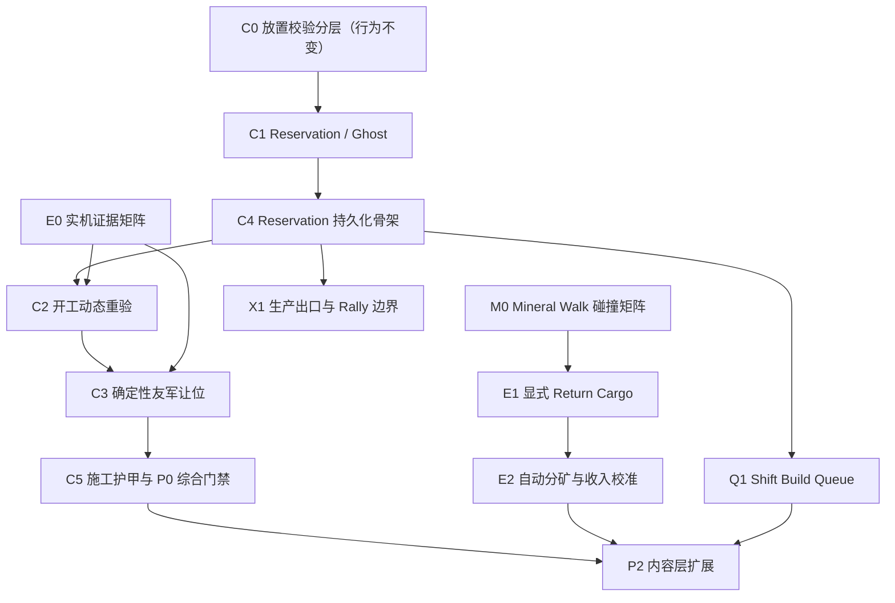

# StarCraft II 对齐实施计划

更新日期：2026-07-13

依据：[StarCraft II 操作与玩法细节对齐研究](SC2_ALIGNMENT_RESEARCH.md)

## 1. 目标与边界

本计划把研究结论转换为可以由 AI 连续实现、验证和提交的工作包。它不包含负责人、会议、工期、故事点等项目管理内容，只定义依赖顺序、稳定协议、测试门禁和停止条件。

这一轮对齐的目标不是复制 SC2 的全部内容，而是先修正会直接影响操作正确性、经济结果和战术选择的差异：

1. 施工意图、可见 Ghost 和硬 Pathing Footprint 必须分离。
2. 动态单位不能再与静态 Placement、建筑占地和导航连通性混成一个布尔校验。
3. 采矿穿行、显式 Return Cargo、自动分矿和 Shift 建造必须拥有稳定订单语义。
4. 所有新增未来态必须进入回放、热恢复和状态 Hash。
5. Godot/UI 只消费不可变快照，不拥有放置、让位、采矿或退款规则。

以下内容不属于本轮强制完成项：完整三族机制、Power/Creep、Add-on、Lift/Land、Cloak/Burrow 的技能开关与种族内容、Extractor Trick、逐帧复制 SC2 动画，以及没有实际失败证据的 Steering 微调。基础 Cloak/Burrow/Detection 感知矩阵后来因施工阻挡的真实依赖进入 D0 并已完成。MULE 的完整召唤、寿命、修理和数值平衡仍属于内容扩展，但它与普通 Worker 独立占用矿片的采集能力合同纳入 E2 强制设计与测试，不能以后加 MULE 时重写经济内核。

## 2. 当前基线

| 领域 | 当前状态 | 本计划处理 |
|---|---|---|
| Harvest/ReturningCargo 单位碰撞豁免 | 核心已对齐 | 只补独立矩阵回归，不重写 Steering |
| 建筑与地形仍阻挡采矿农民 | 已对齐 | 作为碰撞矩阵硬门禁 |
| 最近有效 DropOff 与最近建筑边缘 | 主路径已对齐 | 补显式 Return Cargo 与包围边界实验 |
| 玩家批量右键资源后的自动分矿 | 已对齐 | E2a～E2c 已锁定普通/MULE 槽位、Rally 填空、枯竭收缩与收入曲线门禁 |
| Preview 无副作用 | 部分对齐 | 拆成静态可见校验快照 |
| 下单后的 Ghost/Reservation | 已对齐架构时序 | 权威施工意图独立于 Hard Footprint |
| 工人到达前的建筑占地 | 已对齐 | ReservedApproach 不进入 Pathing，开工才 Hard Commit |
| 开工前动态重验 | 主路径已对齐 | 已覆盖静态晚期失效与单友军撤离；完整矩阵仍待 E0 |
| 己方单位让位 | 工程主链完成、策略待实机 | 1/8/32 分槽与订单恢复已锁定；E0 决定 Hold/Harvest 等动作 |
| 隐藏敌人不泄露 | 普通战争迷雾与侦测边界已对齐 | PlayerKnown 不读当前不可见/未侦测单位、建筑或 Reservation；Ally 待正式系统 |
| 施工中建筑护甲 | 已对齐 | C5 已修正为 0，完成 Tick 后生效 |
| 取消返还 75% | 已对齐 | Reservation 取消时保持一致 |
| Builder 中断与续建 | 主路径已对齐 | 新状态机回归保护 |
| Build Shift Queue | 已对齐 | Q1 已覆盖预扣、软 Reservation、逐项重验、跳过/退款、取消、死亡和回矿 |
| 生产出口阻挡 | 已对齐 | X1 已覆盖 Rally 方向、友军软封、敌军/静态硬封、恢复及目标死亡时序 |

## 3. 不可破坏的设计规则

### 3.1 分层合同

施工放置固定分成五层：

1. `TerrainBuildability`：世界边界、地图静态可建造区域。
2. `StaticPathing`：单位真实可走表面与 clearance。
3. `StructurePlacementFootprint`：建筑、资源排斥、规则层重叠。
4. `StructurePathingFootprint`：开工后才加入导航与碰撞的硬占地。
5. `DynamicOccupants`：单位在 Preview、提交和开工时的不同处理。

`BuildingPlacementValidator` 不再一次读取全部五层并直接决定最终行为。静态校验、动态重验和硬提交必须有独立结果类型，禁止继续向 `BuildingPlacementCode` 堆叠所有时序语义。

### 3.2 权威状态与表现边界

- 模拟层拥有 Reservation、扣费、Builder、队列位置、阻挡原因、让位计划和 Hard Commit Tick。
- Godot 层只读取 `ConstructionPresentationSnapshot` 一类不可变快照，绘制 Preview/Ghost/进度/失败提示。
- 光标 Preview 不能写命令、扣资源、分配 ID 或修改导航。
- UI 预览只能读取该玩家已知信息；隐藏单位不得通过颜色、错误码或 Ghost 消失泄露。
- 让位是模拟产生的确定性派生行为，不由 Godot Tween、物理碰撞或表现节点执行。

### 3.3 ID 与生命周期

接受建造命令时分配稳定 `GameplayBuildingId`，同时建立独立 `ConstructionReservationId`。`DynamicFootprintId` 在 Hard Commit 前必须为空/无效；三种 ID 不互相冒充。

建议生命周期：

```text
TargetingPreview（非权威）
  -> ReservedApproach
  -> RevalidatingStart
  -> EvictingFriendlyOccupants / BlockedAtStart
  -> Constructing（原子创建 Hard Footprint）
  -> WaitingForBuilder / Completed
  -> Canceled / Destroyed
```

同一位置的 Reservation 可以阻止同一玩家重复预订，但默认不参与单位寻路。真正改变导航版本、Path Cache 和局部碰撞的唯一时刻是 Hard Commit。

### 3.4 确定性与持久化

- 所有排序最后使用稳定 ID 打破平局，不依赖集合枚举顺序、帧率或 Godot Node 顺序。
- 命令日志记录玩家意图；友军让位路径属于可重演的派生状态，不重复写入玩家命令日志。
- 一旦工作包新增会影响未来 Tick 的状态，必须同包升级 Replay Package、Runtime Hot Snapshot 和 State Hash，并覆盖中途恢复。
- 测试只能通过正式业务门面下命令并读取稳定测试快照，不能访问 `ConstructionSystem`、`EconomySystem`、Steering、NavMesh 私有数据。

## 4. 依赖顺序



`C0`、`C1` 和 `C4` 不需要等待 SC2 客户端：分层、Reservation 以及它的持久化边界是已经确定的架构事实。`C2` 可以先实现阻挡分类和保守策略，但己方 Idle/Hold/Harvest 等对象究竟自动让位还是拒绝，必须由 `E0` 结果冻结。没有实机结果时，默认保持 `RejectDynamicOccupant`，不得猜测后直接写死。

## 5. P0 工作包：施工正确性

### E0：SC2 当前客户端实机证据矩阵

目的：只冻结公开资料无法确定的动态占位时序，不重新研究已有 A/B 级事实。

实验矩阵至少覆盖：

- 自己 SCV：Idle、Move、Hold、Harvest、携货 ReturningCargo。
- 自己战斗单位：Idle、Move、Hold。
- Builder 自身与同选中组中的其他单位。
- 盟友单位、可见敌军、下单后进入的敌军。
- 隐藏/潜地敌军：未侦测、已侦测。
- 小、中、大、主基地四种 Footprint；单个、8 个、32 个占位单位。
- Shift 连续下三座建筑；中间位置被动态阻挡。
- 8/16/32 个 Hold 单位围住基地时自动返矿和显式 Return Cargo。

每条结果只记录：SC2 客户端版本、模式/地图、对象与订单状态、Preview 颜色、命令是否接受、Ghost 是否存在、原单位订单是否改变、Hard Footprint 出现时点、失败/退款/队列后续，以及对应原始录像。

输出合同：新增 `docs/SC2_EXPERIMENT_RESULTS.md`。未知项保留 `Unknown`，禁止用“看起来像”替代结论。录像不是本项目自动测试视频，可以独立归档，不强迫进入每次全量录制。

### C0：拆开放置校验，保持现有行为（已完成）

目标：先重构语义，不改变玩家能观察到的结果。

建议新增合同：

- `StaticPlacementRequest/Result`：边界、静态障碍、建筑 Placement Footprint、资源排斥、clearance 与可选 Connectivity Policy。
- `DynamicStartValidationRequest/Result`：开工瞬间的单位阻挡分类。
- `HardFootprintCommitRequest/Result`：原子创建/失败，不承担预览逻辑。
- `PlacementKnowledgeScope`：Authority、PlayerKnown；防止 UI 调用 Authority 动态信息。

允许修改：`BuildingPlacement.cs`、`RtsSimulation` 放置门面、测试门面和现有放置测试。

不允许修改：施工生命周期、扣费时点、导航行为、UI 表现。

收口门禁：现有全部测试行为不变；小/中/大/Huge、资源节点、边界、静态/动态建筑重叠、clearance 与 Connectivity Guard 均有独立结果码回归。

完成结果（2026-07-13）：新增 `StaticPlacementResult`、`DynamicStartValidationResult`、`BuildingPlacementAssessment` 和 `HardFootprintCommitResult`。静态层独立负责请求合法性、边界、静态障碍、既有结构、clearance 与 Connectivity Guard；动态层只负责活单位占位；Hard Commit 在同一模拟调用中重新组合评估，通过后才创建 Dynamic Footprint。组合器保留旧优先级：早期结构失败优先于单位，单位优先于窄缝/连通性。`building-placement-rules` 通过稳定测试门面分别验证 Invalid、Outside、Static/Dynamic Footprint、UnitOverlap、InsufficientClearance 和成功提交，最终仍只创建两座合法建筑；施工、Preview、导航失效和 UI 可观察行为不变。未新增权威未来态，因此本包不升级 Replay/Hot/Hash。

### C1：引入 Reservation 与 Ghost（已完成，2026-07-13）

目标：接受建造命令后保存施工意图，但 Builder 到达前不创建硬占地。

权威数据至少包含：

- `ConstructionReservationId`、稳定 `GameplayBuildingId`、玩家与 Builder。
- 已解析的 Building Profile、目标中心/Bounds、可选 Refinery Node。
- 已支付资源、取消退款规则、接受 Tick、队列序号。
- 当前状态、最近一次阻挡分类、失败/取消原因。
- `FootprintId` 可空，直到 Hard Commit 才赋值。

这一包同时定义 Reservation 的完整持久化骨架，包括后续动态重验和让位需要的版本化策略字段、阻挡分类与确定性进度游标；不能先把只存在于内存中的 Reservation 合入主线，再等 C4 补救。

行为：

- 命令接受后立即扣费并创建 Reservation/Ghost。
- Builder 向合法接近点移动，其他单位仍可穿过尚未开工的目标区域。
- Reservation 参与同玩家重复预订和建筑 Placement 冲突，但不加入单位 Pathing。
- 取消释放 Reservation；未开工与施工中的退款均继续使用 Profile 的 75% 规则。
- Refinery Reservation 在接受时预订气矿节点，取消/失败必须可靠释放。

表现只增加 Ghost 快照：`State`、`Bounds`、`Progress`、`KnownBlockerKind`、`CanCancel`。Godot 不读取 ReservationStore。

黑盒用例：`construction-reservation-no-hard-footprint`，覆盖四种尺寸、Builder 远距离接近、其他单位直穿预订区域、取消、重复预订、气矿独占。

完成结果：新增独立 `ConstructionReservationStore`，接受命令时分配稳定 Building/Reservation ID 并扣费，Builder 到达前 `FootprintId=0`，不会修改导航版本或阻挡普通单位；同位置的建造命令和通用 Placement 会被 Reservation 拒绝。Godot 只消费不可变建筑快照绘制半透明 `GHOST`，不读取 Store。正式用例命名为 `construction-reservation-hard-commit`，已验证单位穿越、重复预订拒绝、75% 取消退款、晚到友军撤离和唯一 Hard Commit。

### C2：开工动态重验与阻挡分类（PlayerKnown/Authority 工程边界完成，策略矩阵部分完成）

目标：Builder 到达后，以 Authority 信息重验动态占位，并把结果表示成稳定状态，而不是一次 `UnitOverlap`。

阻挡分类至少预留：

- `None`
- `MovableFriendly`
- `ImmovableFriendly`
- `Ally`
- `VisibleEnemy`
- `HiddenEnemy`
- `LateStructureOrReservation`
- `StaticPlacementChanged`

处理策略必须由数据/策略表决定，不能散落在状态机 `if` 中。策略结果为 `Commit`、`BeginEviction`、`Wait` 或 `FailAndRefund`。E0 尚未确认的对象默认 `Wait/Reject`，不自动推开。

Preview 继续只使用 PlayerKnown 信息；Authority 重验可以发现隐藏阻挡，但对外发布的提示必须经过可见性过滤。正式 Cloak/Burrow/Detection 能力层现已接入该入口，不存在“只有测试才有”的假潜地分支。

黑盒用例：`construction-ghost-late-blocker`、`construction-visible-enemy-blocker`、`concealment-detection-construction`。最后一项已经启用未侦测/已侦测完整期望。

当前完成边界：Builder 到达后会重新执行正式 `BuildingPlacementAssessment`；成功才原子提交 Hard Footprint，动态单位阻挡会进入 `BlockedAtStart`。`ConstructionBlockerKind` 与 `ConstructionBlockerPolicy` 已把 MovableFriendly、Hold、EconomyTask、AssignedBuilder、OtherOrder 和 AuthorityEnemy 从施工状态机分离；ProjectDefault 只让 Idle/Stop/Move 友军撤离，其余在没有 E0 证据时统一 Wait。施工 Builder 在 `ReservedApproach/BlockedAtStart` 临时关闭单位碰撞，但仍受建筑和地形约束。接近点使用四边候选、直达优先和真实路径可达性选择。

PlayerKnown 边界现已落地：Preview/Issue 忽略己方软占位和当前不可见的敌军单位、Gameplay Building 与 Reservation；当前可见敌军仍返回 `UnitOverlap`。己方单位内可直接建立软 Reservation，再在到场时进入既有策略表。全局 Connectivity Guard 不再在玩家预览阶段读取 Authority 拓扑，只在 Hard Commit 前运行。动态重验先执行静态几何与单位快检，只有占位已经清空时才运行昂贵的全图连通性门禁。

公开反馈使用派生 `PublicConstructionStatus`，只暴露 `None / ClearingFriendlyUnits / KnownOccupant / WaitingForClearance`，不发布 Authority blocker ID、阵营或隐藏原因。`construction-player-known-placement` 经正式 Preview、Build、Hold、Move、PlayerView 门面验证友军内预放置、可见敌军拒绝、隐藏敌军无预览差异、到场 Authority 等待、解除后完工及 Package/Hot 规范往返。专项 AV1/WebM 位于 `test_videos/20260713_194851/`。

当前完成边界新增 D0：`UnitPerceptionProfileSnapshot` 独立声明 `None/Cloaked/Burrowed` 与 DetectionRange；视野网格旁维护派生侦测网格。PlayerView、显式攻击、PlayerKnown 放置、Authority 通用反馈和隐蔽目标自动索敌均消费同一感知合同；Burrowed/普通单位接触豁免不影响建筑与地形。Replay Package v27、Hot Snapshot v26、State Hash v27 保存并校验该权威 Profile。

`concealment-detection-construction` 的 1280×720、212 帧 AV1/WebM 位于 `test_videos/20260713_204122/`；专项与 115/115 全量黑盒回归均通过。

尚未完成：盟友最终分类与共享视野，以及 E0 对 Hold、Harvest、可见敌军等动作的实机策略冻结。Cloak/Burrow 的开关、能量/研究、扫描和特殊单位例外属于后续内容能力，不重写 D0 或施工入口。

### C3：确定性友军让位（有限工程闭环完成）

前置：E0 已冻结哪些对象会让位、原订单如何处理、Hold 是否例外和最大等待策略。

建议新增纯模拟模块 `ConstructionEvictionPlanner`：

- 输入只有 Footprint、单位公开占位快照、StaticWorld 查询接口、策略 Profile 和稳定 Tick。
- 候选目的地位于扩张 Footprint 外沿的可通行位置，不得进入建筑、地图外或不满足单位 clearance 的区域。
- 先按到最近合法边的距离分配，再以 Unit ID 打破平局；边顺序固定。
- 多单位目标槽位考虑各自半径，禁止全部指向同一点。
- 生成系统派生的临时让位意图，明确是覆盖、暂停还是恢复原订单；具体规则服从 E0。
- 设置有界重规划次数和清场 Tick；超界转为稳定 `BlockedAtStart`，不无限抖动。
- 单位死亡、离开、进入、Builder 中断和多个 Reservation 竞争均在下一确定性 Tick 重验。

黑盒用例：`construction-soft-friendly-occupants`，固定覆盖 1/8/32 单位和四种 Footprint；指标为接受码、让位数、最大清场 Tick、Hard Commit 唯一、建筑穿透 0、单位出界 0、错误弹出 0。

复杂回归：在默认 Player vs AI 对局中从己方矿区单位群内放置 Supply Depot、Barracks 和 Command Center，保证不会破坏采矿循环和 AI 建造。

当前完成边界：新增无状态 `ConstructionEvictionPlanner`，按 Unit ID 处理最多 64 个阻挡者，在三圈稳定外沿候选中为不同半径单位分配互不重叠且通过静态通行检查的目标；只在占位集合变化时重新规划，活动计划每 Tick 只重申已有目标。施工撤离不再调用玩家 Move，也不清活动订单或 Shift 队列，而是使用 `UnitCommandQueueStore` 中独立的系统临时覆盖层；Hard Commit 或取消后，原 Move 目标/待处理队列恢复，原 Idle/Stop 在外侧停止。玩家新下达的非 Shift 命令仍可显式覆盖临时让位。

`construction-multi-unit-eviction` 只使用正式 Build、Hold、ResumeConstruction、Move、Stop 和稳定观察快照，覆盖四档尺寸与 `1/8/8/32` 占位单位；观察到的临时撤离数精确为 `1/8/8/32`，Hold 建筑保持 `BlockedAtStart` 直到玩家解除，活动 Move 和一个后续队列项在让位期间保持并最终完成。Replay 与活动 32 人撤离期间的 Hot Restore 逐 Tick 一致。专项 AV1/WebM 位于 `test_videos/20260713_185509/`。

系统覆盖层进入 Replay Package v26、Hot Snapshot v25 和 State Hash v26；Unit Command Log 保持 v4，因为让位不是玩家意图。C3 的工程机制至此不再需要重写；普通战争迷雾敌军的预览/到场边界已补齐。后续 D0 已补 Cloak/Burrow/Detection；剩余是 E0 决定策略表和 Ally 矩阵。

### C4：Reservation 最小持久化骨架与重演闭环（已完成，2026-07-13）

目标：在 C1 后立即让 ReservedApproach 可以保存和重演，并为后续 Evicting、BlockedAtStart、Constructing 和 WaitingForBuilder 预留完整、版本化的未来态字段。C2/C3 只能填充已经定义的状态；如果实现中证明字段不足，必须在对应功能提交内再次显式升级格式。

同一个工作包完成：

- Construction command log 格式升级。
- Replay Package 格式升级。
- Runtime Hot Snapshot 格式升级。
- State Hash 格式升级。
- Reservation、可空 Footprint、阻挡分类、版本化让位策略/进度游标和队列顺序的 codec。
- 旧格式明确拒绝，不静默猜测缺失未来态。

初始门禁覆盖 ReservedApproach；C2/C3 加入后，各自在同一门禁中补齐其新增非终态。“原运行 vs 中途热恢复 vs 从命令回放”必须逐 Tick Hash 对比；重复加载不重复扣费、不重复创建 Footprint、不丢 Refinery 绑定。

完成结果：Construction Command Log v3、Replay Package v20、Runtime Hot Snapshot v20、State Hash v21 已编码 Reservation Store、Next ID、可空 Footprint、接受 Tick、Builder 接近点和新增生命周期；旧版本明确拒绝。`construction-reservation-hard-commit` 在 Tick 120 捕获 `ReservedApproach`，3351B 热快照恢复到 Tick 720 后与原运行最终 Hash 一致；`construction-replay-persistence` 同时验证活动施工、取消、Refinery 和命令回放不重复派生 World Command。

### C5：施工中护甲与 P0 综合收口（已完成，2026-07-13）

规则：`ReservedApproach`、`RevalidatingStart`、`EvictingFriendlyOccupants`、`Constructing` 和 `WaitingForBuilder` 的有效 Armor 为 0；只有完成 Tick 后才应用建筑基础护甲和科技护甲。

不修改 Profile 中的完整建筑 Armor。战斗系统应根据生命周期读取有效值，快照向 UI 提供最终有效 Armor，避免表现层复制判断。

用例：`construction-under-build-defense`，同武器攻击 10%、50%、完成前一 Tick和完成后一 Tick的建筑，校验伤害、状态 Hash 与热恢复一致。

完成结果：建筑 Type/Profile 继续保存完整基础护甲，`GameplayBuildingSnapshot.EffectiveArmor` 只暴露当前生命周期与科技共同决定的最终值；`ReservedApproach` 至 `WaitingForBuilder` 始终为 0，进入 `Completed` 的同一 Tick 才切换到基础护甲与科技护甲。战斗伤害预览、正式建筑受击、Godot/UI 和稳定测试快照统一通过 `RtsSimulation` 门面消费该派生值，不在表现层复制状态判断。新增 `construction-under-build-defense` 在 12.5%、52.5%、98.3% 和 100% 进度分别验证 Armor `0/0/0/6`，预览和真实命中伤害均为 `20/20/20/14`；Replay、Hot Restore 与原运行最终 Hash 同为 `9A2DB845CEDC72A2`。有效护甲是纯派生读模型，不新增权威未来态，因此沿用 Construction Log v3、Replay Package v20、Hot Snapshot v20 和 State Hash v21。104/104 全量黑盒回归通过；专项 AV1/WebM 位于 `test_videos/20260713_131501/`。

P0 综合完成条件：C0～C5 全部通过，E0 已确认的规则有来源和录像，4 个 P0 场景均通过正式门面运行，并保存 AV1/WebM 自动录像。若隐形系统仍未存在，`construction-hidden-enemy-blocker` 允许保持“协议已锁、运行时待依赖”，不能用假实现声称完成。

## 6. P0 并行工作包：采矿碰撞回归

### M0：Mineral Walk 碰撞矩阵（已完成）

这一包优先补测试，除非测试暴露错误，否则不改寻路和 Steering。

场景：24～40 个 GoingToResource/ReturningCargo 农民依次穿过己方 Hold、敌方小型单位和大型单位车道；同地图加入建筑墙；中途对一半农民下 Stop/Hold/Attack。

稳定测试快照只暴露订单、经济阶段、位置、是否到达、建筑穿透计数和最大重叠恢复 Tick，不暴露 `_unitCollisionSuppressed`。

完成条件：Harvest/ReturningCargo 穿越完成；建筑和地形穿透 0；Stop/Hold/Attack 后有限散开；不可达 0；性能不低于当前同规模测试的硬门禁。

完成结果（2026-07-13）：新增 `economy-mineral-walk-collision-matrix`，24/24 Worker 去程和 24/24 返程完成；友军 Hold、敌军小型单位、大型单位三条车道均记录到真实单位重叠；正式 Supply Depot 穿透 0 且确认绕行；Stop/Hold/Attack 探针分别在 2/4/2 Tick 恢复分离；不可达 0。场景只使用 `MovementTestRig` 正式业务门面和稳定快照，未读取碰撞抑制、Steering 或 UnitStore 内部状态。对应 AV1/WebM 位于 `test_videos/20260713_113009/`。

## 7. P1 工作包：经济与操作完整性

### E1：显式 Return Cargo（已完成，2026-07-13）

新增正式订单 `ReturnCargo`，仅携货 Worker 可执行。它选择最近有效 DropOff，成功投递后恢复保存的采集意图或继续 Shift 后续订单。

必须定义：

- 携矿改派气矿、携气改派矿物时的 Cargo 保留。
- DropOff 途中被摧毁、失效或换所有权时的重新选择。
- 无有效 DropOff 时的稳定等待/失败码。
- Stop/Hold/Attack 是否清除恢复采集意图。
- 普通右键新资源、显式 Return Cargo、Shift Return Cargo 的差异。

同包更新订单校验、命令日志、Replay/Hot/Hash、命令卡快照和玩家/AI 可共用的意图门面。`economy-explicit-return-cargo` 覆盖普通返还、Stop 后返还、矿转气、气转矿、Shift Return Cargo、命令日志、Replay 与热恢复；`economy-return-cargo-dropoff-loss` 隔离覆盖最近 DropOff 失效后改道、全部失效时携货等待、`MissingDropOff` 和恢复后自动续投。

完成结果：新增正式 `UnitOrderKind.ReturnCargo`、`ReturnCargoCommandResult`、`WaitingForDropOff` 与命令卡动作。携货 Worker 收到新 Gather 时不再清空 Cargo，而是先投递再前往新资源；Stop/Hold/Attack/Move 保留货物但清除恢复采集意图，因此之后显式返还会投递并 Idle。活动投递点失效时会更新移动目标到新的最近有效边缘，全部失效则停止并保留 Cargo，恢复后自动继续。普通显式返还写入 Economy Command Log v3；Shift 返还写入 Unit Command Log v4；Replay Package/Hot Snapshot v21 与 State Hash v22 拒绝旧版本。专项结果为普通返还恢复 `True`、Stop 后返还并 Idle `True`、矿↔气 Cargo 双向保留 `True/True`、Shift 返还 `True`、DropOff 改道/等待/恢复 `True/True/True`、不可达 0；106/106 全量黑盒回归通过。AV1/WebM 位于 `test_videos/20260713_142242/` 与 `test_videos/20260713_142815/`。

### E2：批量自动分矿

先废除 `HarvesterCapacity` 同时表示“实际并发采集数”和“理想分配人数”的含混合同。普通矿片固定区分：

- `NormalActiveSlots=1`：同一时刻最多一个普通 Worker 执行实际采集动作。
- `IdealNormalAssignments=2`：两个普通 Worker 通过往返错峰形成 UI/AI 使用的高效软饱和；标准八矿为 16 个理想矿工。
- 第三个普通 Worker 允许进入等待队列并产生递减边际收益；不能把两人软饱和误做成拒绝命令的硬上限。
- 第四个及更多 Worker 仍可接受 Gather，但标准距离下不得伪造额外并发采集吞吐；测试验证其收入不高于三人层的容差上限。
- MULE 使用独立 `GathererCapability`/采集通道：可与一个普通 Worker 同时采同一矿片，不计入普通矿工 `Assigned/Ideal`；同一矿片同时最多一个 MULE，多个 MULE 在矿簇内独立分散或排队。E2 只实现并验证该能力合同，不实现召唤、寿命和完整单位内容。

新增独立确定性 `ResourceAssignmentPolicy`。它在玩家批量 Gather、Rally 新 Worker、Worker 到达时发现首选矿被占用、当前矿枯竭/失效或明确转场时运行；不在每 Tick 为追求最优收入而全局重排。运行时维护增量 Active/Assigned/Waiting 计数，避免大量 Worker 时反复扫描全部单位。

分配输入：同一所属基地资源簇、资源类型、普通/MULE 能力、每节点 Active/Assigned/Waiting、预计可用时刻、Worker 到矿和矿到 DropOff 的额外路程、是否为玩家明确点中的首选矿。输出使用稳定 Worker/Node ID 决胜。普通右键把被点矿片视为首选而不是永久唯一节点；单选精确点击仍允许 SC2 式“占用时改选”，若要模拟反复右键强制近矿，必须由当前客户端实验冻结，不凭猜测添加不可取消的一轮锁。

稳定快照分别暴露 `ActiveNormal/AssignedNormal/WaitingNormal/ActiveMules/AssignedMules`，基地快照分别提供 Mineral/Gas 的 Assigned 与 Ideal；UI、AI 和测试不得用采集槽数量反推软饱和。

场景 `economy-auto-patch-distribution`：8 片矿，12/16/24/32 Worker 全部右键同一片矿，记录首轮分散和每片 Active/Assigned/Waiting。16 Worker 必须形成两人软饱和；24/32 Worker 可进入等待队列，但任意时刻每片普通 Active 不得超过一个。Rally 填空与枯竭收缩由 `economy-assignment-lifecycle` 隔离验证；近/远矿和第二/第三/第四 Worker 边际收入由 `economy-mining-income-curve` 隔离验证，避免一个长场景掩盖失败原因。

场景 `economy-mule-independent-mining`：同一矿片覆盖 `2 SCV`、`2 SCV + 1 MULE`、`2 SCV + 2 MULE`，验证普通通道一次只采一个、一个 MULE 可与普通 Worker 同采、第二个 MULE 等待；再在八矿投放多个 MULE，验证分散、普通 `16/16` 饱和度不变、回放/热恢复/Hash 一致。MULE 测试可使用能力化测试采集者，不要求先做 Orbital Command。

数值校准使用内容 Profile：常规/富矿携带量 5/7、占矿约 1.99 秒、离开停顿约 0.3571 秒作为 SC2 预设目标；通用经济内核继续允许其他数值。先验证收入区间，不追逐逐帧一致。

当前完成边界（E2a）：普通 Worker 通道已经拆成 `NormalActiveSlots`、`IdealNormalAssignments`、`ActiveNormal`、`AssignedNormal` 和 `WaitingNormal`，普通矿默认/可玩关卡采用 `1/2`；基地快照按矿物/瓦斯分别暴露 Assigned/Ideal。无状态 `ResourceAssignmentPolicy` 已接入非 Shift 批量资源 SmartCommand、Shift Gather 真正出队、资源 Rally、新基地转场、到矿占用和资源失效重选，并以 Worker/Node 稳定 ID 决胜，不执行逐 Tick 全局重排。节点增量计数进入 Replay Package/Hot Snapshot v22 与 State Hash v23，恢复时会按 Worker 状态交叉校验计数。

`economy-auto-patch-distribution` 已通过同一片矿四阶段点击 `12/16/24/32` Worker：八片矿 Assigned 差始终不超过 1，16 人为每片 2 人，24/32 人进入 3/4 人分配但 `ActiveNormal<=1`，Waiting 队列被实际观察到；32 条经济命令回放与 Tick 300 热恢复精确一致。原 96 Worker/32 矿压力场景也已改用 `1` 个并发槽和 `2` 个理想位并通过。专项 AV1/WebM 位于 `test_videos/20260713_145302/`。E2 尚未整体收口：下一段只补 MULE 独立能力通道与 `economy-mule-independent-mining`，再补 Rally 填空、枯竭收缩和近/远矿边际收入的专项门禁；不回头继续微调普通分配器。

当前完成边界（E2b）：`GathererCapability` 已将 `NormalWorker` 与 `Mule` 从“是否能施工”中解耦。MULE 可走正式 Gather/Return Cargo、批量资源 SmartCommand 和采矿穿行，但不属于普通 Worker，不计入基地 Assigned/Ideal、经济 UI Worker 数、施工资格或比赛 Worker/CombatUnit 能力；MULE 只能采矿，采气返回 `CapabilityUnavailable`。每个矿点的 `ActiveMules<=1`，MULE 分配使用独立 `AssignedMules/1` 负载率，与普通 `AssignedNormal/IdealNormalAssignments` 互不影响。能力进入 Worker 运行时条目、规范二进制、热恢复校验和状态 Hash，Replay Package/Hot Snapshot 升级 v23，State Hash 升级 v24。

`economy-mule-independent-mining` 已通过：隔离矿片上 `2 SCV + 1 MULE` 实际出现普通/MULE 同时采集，加入第二个 MULE 后观察到一个 Active、一个 Waiting；主矿簇保持普通 `16/16`，八个 MULE 批量点同一矿后形成 `8/8` 独立分散，普通饱和度不变。MULE 不进入公开 Worker 列表，28 条经济命令 Replay 与 Tick 360 热恢复精确一致。专项 AV1/WebM 位于 `test_videos/20260713_150930/`。E2 下一段只做 E2c：Rally 填空、枯竭收缩、近/远矿和第二/第三/第四 Worker 边际收入门禁；不实现 Orbital、召唤、寿命、修理或完整 MULE 数值内容。

当前完成边界（E2c）：`economy-assignment-lifecycle` 从同点矿形成 `7×2 + 1×1` 的 15 Worker 分配，Town Hall Rally 新生产 Worker 会确定性填入唯一欠载矿片并达到 `8×2`；首片矿枯竭后其 `Active/Assigned/Waiting` 全部归零，16 个 Worker 收缩到其余七片矿且最大 Assigned 差为 1。该场景同时验证 Replay Package 与 Tick 300 Hot Restore 精确一致。

`economy-mining-income-curve` 在统一 `5` 携带量、`1.99s` 占矿时间和固定 30 秒窗口下测得近矿 `1/2/3/4 Worker = 30/55/65/65` Minerals，边际收入为 `+25/+10/+0`；双 Worker 远矿为 `25`，低于近矿双 Worker 的 `55`。这组门禁冻结的是“第二人高收益、第三人递减、第四人不再增益、远矿更低”的业务曲线，不声称逐帧复刻某一 SC2 地图的每分钟绝对值。两段专项 AV1/WebM 位于 `test_videos/20260713_152402/`。

E2 至此整体收口。后续普通矿距离、携带量或采集时间只通过内容 Profile 调整；除非真实玩法或新的 SC2 实机证据击穿上述合同，否则不再修改分配权重或经济状态机。Orbital、MULE 召唤/寿命/修理仍属于 P2 内容扩展。

### Q1：Shift Build Queue

状态：已完成。前置的 Reservation 和持久化闭环已稳定。

每个 Build 队列项保存解析后的 Building Profile、目标 Bounds、Refinery Node、提交顺序与扣费/Reservation 状态。接受命令时即分配稳定 Building/Reservation ID 并扣费，但未来项只创建软 Reservation，不提前创建 Hard Footprint；真正轮到执行时重新验证静态放置，再沿既有 Builder 接近、动态占位撤离和 Hard Commit 主链推进。

官方资料确认可用 Shift 连续排结构，并可在建造后排回矿；没有找到足够公开证据冻结精确扣费时点与晚期失败行为。因此本项目不冒充逐帧复刻，而是以 `QueuedConstructionPolicy` 显式冻结当前策略：`ReserveOnIssue`、`RefundAndContinue`、`RefundPendingReservations`。晚期静态失效全额退款并继续下一项；玩家主动取消仍沿通用规则退 75%；Builder 死亡保留已轮到且可续建的 Reservation，未轮到的未来项全退并取消。

`construction-queued-builds` 已用稳定业务门面覆盖八次 Shift Build、三种不同尺寸、下单即扣费、未来项 Hard Footprint=0、中间静态失效全退并跳过、动态友军进入后撤离、玩家取消 75%、Builder 死亡清理未来项、两条队列继续完成并回矿。Construction Command Log 升级 v4，Replay Package 升级 v24；Hot Snapshot 保持 v23、State Hash 保持 v24，因为现有建筑 Reservation 与 UnitOrder 未来态已经完整覆盖新增运行时状态。专项 AV1/WebM 位于 `test_videos/20260713_161943/`。

Q1 至此收口。下一项进入 X1 生产出口与 Rally 边界，不继续为 Shift Build 添加启发式；只有新的实机证据或黑盒失败才能调整上述策略字段。

### X1：生产出口与 Rally 边界

状态：已完成。

保留 12 个稳定候选与 `WaitingForExit` 语义。`ProductionExitResolver` 将地形、建筑和敌军占用归为硬阻挡；只含友军时归为软阻挡，并按 Unit ID 稳定顺序请求既有施工撤离能力寻找合法外侧点。候选出口按到 Rally 目标的距离排序并以候选序号决胜；没有 Rally 时保持固定候选顺序。每个完成订单最多检查 12 个候选和当前单位集合，不增加逐 Tick 全局出口扫描。

Blizzard 官方资料明确了玩家可观察的两种目标死亡边界：目标在单位离开生产建筑前死亡，新单位不会执行 Rally；目标在其出生后死亡，单位继续前往目标最后占据的位置。当前实现因此把有效友军 Rally 解析为系统派生 `FollowFriendly` 活动订单；目标存活时仅在位置变化至少 8 px 后重发移动，目标死亡后转成普通 Move 到最后位置。它不写入玩家 Unit Command Log，但活动未来态进入 Hot Snapshot 和 State Hash。公开资料没有确认 SC2 内部“友军软、敌军硬”的精确分类，因此该分类明确记为本项目可替换的确定性策略，不伪装成官方内部实现。

`production-exit-rally-boundaries` 只经稳定业务门面建造 8 座生产建筑、设置四方向/友军单位 Rally、生产单位、移动/攻击目标并观察不可变快照。520 Tick 结果为：方向 `True/True`、友军软封撤离/出生 `True/True`、敌军硬封等待/解除恢复 `True/True`、出生前/后死亡 `True/True`，Replay 与 Tick 300 Hot Restore 精确一致。专项 AV1/WebM 位于 `test_videos/20260713_173106/`。

Replay Package 升级 v25、Hot Snapshot 升级 v24、State Hash 升级 v25；Unit Command Log 保持 v4、Production Command Log 保持 v8，因为 Follow 是可重演的系统派生状态而非玩家意图。当前 112/112 全量 Godot 黑盒回归通过。

只有实测证明不同建筑出口规则影响玩法时，才新增数据化出口 Profile；不为每座建筑手写分支。

X1 至此收口，并满足本计划最后一个可在当时证据下执行的 P1 工作包。本轮 SC2 核心对齐停止继续添加启发式：C2/C3 的 Hold/Harvest/敌军动作仍等待 E0；后来因真实施工依赖补完的 Visibility/Detection 基础记录为 D0。其余 P2 只由真实内容需求触发。

## 8. P2 内容层扩展

P2 不作为核心对齐收口条件，按实际玩法需求逐项启用：

1. `ConstructionMethodKind` 扩展 `ConsumeWorker`，完整验证 ContinuousWorker、StartAndRelease、ConsumeWorker。
2. Power、Creep、Add-on 空间、Lift/Land 作为 Placement Rule Provider，不侵入通用 Validator。
3. 普通战争迷雾和 Cloak/Burrow/Detection 的 PlayerKnown 矩阵已经启用；后续 Visibility 内容扩展只补盟友关系、能力开关、扫描与种族例外，不重写施工入口。
4. Gold Mineral、MULE 召唤/寿命/修理、Extractor Trick 和种族气矿设施通过资源/能力 Profile 扩展；不得改变 E2 已冻结的普通/MULE 独立采集通道。
5. Connectivity Guard 改为地图/AI 安全策略，玩家正式规则允许战术建筑墙；不能继续把“禁止断路”描述成 SC2 规则。
6. 单位加速度与横向响应只在录制的对照操作暴露可重复差异后进入独立手感包。

## 9. 每个工作包的固定门禁

每个实现包必须按以下顺序自检：

1. Release C# 构建 0 错误、0 警告。
2. 新机制的纯 C# 黑盒测试通过；测试只使用正式业务门面和稳定快照。
3. 全量 Godot 黑盒回归通过，不接受“新用例通过但旧玩法坏了”。
4. 涉及未来态时，回放、checkpoint、热恢复和 State Hash 成对测试通过。
5. 涉及 UI 时，只新增/扩展不可变表现快照；Godot 不读取模拟私有系统。
6. 新视觉 case 自动录制为 AV1/WebM，遵守 [录像规范](VIDEO_RECORDING.md)；只保留最终通过录像。
7. 更新本计划状态和 [进度回顾与 TODO](PROGRESS_AND_TODO.md)，再提交并推送。

性能门禁不以某台机器的单次毫秒数作为唯一正确性条件：保留现有基准硬预算，并比较同机器基线。新的 Reservation 查询应使用局部空间查询；不得每 Tick 对所有单位 × 所有 Reservation 全扫描。友军让位只在 Reservation 状态变化或局部占位变化时重算。

## 10. 防止无限优化的停止规则

- 每个机制最多建立一个隔离矩阵场景和一个复杂对局场景。
- 控制正确性问题必须修；经济/战术差异以有限指标区间验收。
- 没有可复现失败视频、黑盒失败或性能越界，不增加新启发式。
- 不为了“更像”同时改 Steering、碰撞、经济参数和动画；一次只改变一个可归因合同。
- E0 未知项允许保持 Unknown 和保守策略，不用推测填满所有格子。
- P0 完成后立即转入 P1，不继续打磨 Friend Eviction 的像素级轨迹。
- P1 完成后，默认可玩对局若能稳定发展、采集、建设、战斗并通过回放恢复，即视为本轮 SC2 核心对齐收口；P2 由后续真实内容需求触发。

## 11. 推荐的实际提交顺序

每行是一份应保持可独立回退的提交，不要求用临时代码跨包占位：

1. `test: add mineral-walk collision matrix`
2. `refactor: split static placement and dynamic start validation`
3. `feat: add construction reservations without hard pathing`
4. `feat: persist construction reservation lifecycle`
5. `test/docs: freeze SC2 dynamic-occupant experiment results`
6. `feat: revalidate construction start blockers`
7. `feat: add deterministic friendly construction eviction`
8. `fix: disable armor before construction completion`
9. `feat: add explicit return cargo order`
10. `feat: distribute batch workers across resource patches`
11. `feat: queue construction reservations and follow-up orders`
12. `test: cover production exits and rally blocking`

若 E0 暂时无法执行，先完成 1～4；第 6 项只提交分类和保守阻挡，第 7 项暂停，转做第 8～10 项。这样既不阻塞架构推进，也不把 C 级猜测固化为底层行为。

## 12. 总完成定义

本轮计划完成必须同时满足：

- Preview、Reservation/Ghost、动态重验和 Hard Footprint 在协议与时序上分离。
- 已确认的己方单位占位策略确定性执行，隐藏信息不会由 Preview 泄露。
- 施工中 Armor=0，完成后才应用建筑与科技护甲。
- Mineral Walk 碰撞矩阵、显式 Return Cargo、批量自动分矿和 Shift Build Queue 有独立业务测试。
- 所有新增未来态可以确定性回放和中途热恢复。
- 默认大型 Player vs AI 对局继续从 12 Worker 开局完成采矿、建设、科技、生产和交战闭环。
- 全量测试与 AV1 录像门禁通过，计划和总进度文档同步。

完成以上条件后，本轮停止。Power/Creep、完整三族和像素级移动参数不应被用来把“核心对齐”无限延期。
