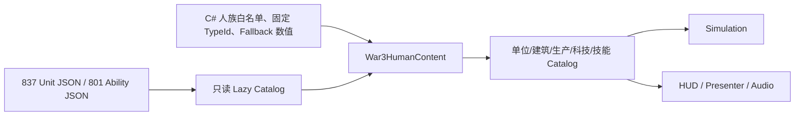
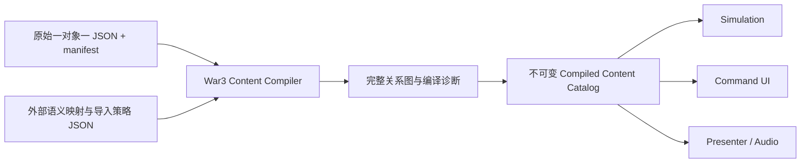

# Warcraft III 内容硬编码专项审计与清零计划

审计日期：2026-07-20  
范围：Godot 项目中的单位、英雄、建筑、技能、科技、物品、Command Card、表现和相关音频接入。  
基线：`docs/WAR3_CONTENT_HARDCODE_BASELINE.json`。

## 1. 结论

当前实现还不是“放入一个合法的 Warcraft III 对象 JSON，单位或建筑就能直接工作”。
它已经具备数据仓库、适配器、内容中立模拟和确定性快照，但实际可玩内容仍由
`War3HumanContent` 中的代码白名单先创建，再让 JSON 覆盖：



因此当前真正自动编译的边界不是 837 个对象，而是代码预先选中的 17 个单位、16 个
建筑、16 条训练配方和 21 项科技。技能也只保证当前切片的 47 个 rawcode / 45 个
base family；不能由“当前切片 missing=0”推导出全量完成。

本专项的最终目标是把链路改为：



生产运行时不再拥有具体人族 rawcode、对象名称、模型路径、科技序号或数值 fallback。
新增对象是否可用只由数据完整性和通用引擎能力决定。

## 2. 什么算硬编码

本审计把代码常量分成四类，避免把完全不同的问题混在一起：

| 类别 | 定义 | 处理原则 |
| --- | --- | --- |
| H1 内容事实 | 某个具体 rawcode、对象名、模型、图标、费用、生命、生产者、科技前置、按钮槽位 | 生产代码清零，迁移到编译数据 |
| H2 静默 fallback | JSON 缺失或字段非法时继续使用手写对象/数值 | 清零；主运行时 fail-fast，工具模式输出显式诊断 |
| H3 引擎语义 | Heal、Summon、Projectile、Aura 等通用处理器及算法 | 处理器保留在代码；`baseCode -> handler/field binding` 迁移到数据注册表 |
| H4 产品/场景规则 | 4x3 Command Card、序列化版本、测试 fixture、演示地图出生点 | 可以保留为命名契约；种族皮肤和可调参数仍应外置 |

“把 C# switch 改成另一个 C# Dictionary”不算清零；“把 rawcode 放进 JSON，但 UI
仍按 `ArcaneVault` 或 `Peasant` 分支”也不算清零。

## 3. 当前量化基线

### 3.1 对象规模与实际可玩范围

| 对象 | 原始导出 | 当前组合层 |
| --- | ---: | ---: |
| Unit Editor 对象 | 837（210 建筑、627 非建筑，其中 89 英雄） | 33（16 建筑、17 单位/英雄） |
| 人族对象 | 108（46 建筑、42 普通单位、20 英雄） | 33 |
| Ability | 801 / 415 base families | 当前运行时 47 / 45 |
| Upgrade | 89 | 手写绑定 21 |
| Buff / Effect | 247 | 仅随已编译技能闭包消费 |
| Item | 273 | 神秘藏宝室 9 件 |

### 3.2 技能覆盖

| 范围 | 已分类 | 未分类 | blocked |
| --- | ---: | ---: | ---: |
| 全量 Ability | 163 / 801 rawcode，62 / 415 family | 638 | 8 |
| 单位实际引用 | 99 / 461 rawcode，54 / 285 family | 362 | 1 |
| Item Ability | 47 / 234 rawcode，22 / 129 family | 187 | 1 |
| 当前人族切片 | 47 / 47 rawcode，45 / 45 family | 0 | 0 |

当前人族切片的 47 条中是 43 gameplay、3 delegated、1 presentation-only。`classified`
只表示已经给出状态，不等于全部拥有完整玩法实现。

### 3.3 静态候选扫描

把 `src/War3Rts` 与 `src/Simulation` 中的四字符字符串和五类对象 manifest 交叉后，
得到 175 处候选、126 个唯一对象 ID、16 个生产源码文件：

- `War3HumanContent.cs`：65 处；
- `War3AbilityBehaviorRegistry.cs`：62 处；
- 其余运行时、表现、物品、音频和地图代码：48 处。

这个数字是候选下限，不包括固定中文文案、模型路径、图标名、UI 像素坐标、数值
fallback 和命名 TypeId。它也包含少量与对象 ID 同名的普通 token，以及放在生产文件
中的 smoke fixture；所以必须结合下述语义审计，不能机械删除 175 个字符串。

## 4. 必须清零的硬编码清单

### HC-001：可玩对象白名单与固定 TypeId

- 位置：`src/War3Rts/War3HumanContent.cs:60-93`。
- 现状：16 个建筑和 17 个单位分别拥有命名常量及手排稠密 ID。
- 影响：未列入的 804 个对象不会进入 production/building/ability/presentation catalog；
  即使 JSON 完整也不能直接实例化。
- 清零：按 manifest 和关系闭包编译全部对象；运行时 ID 由稳定排序和 content hash
  生成。业务查询使用 `ContentObjectKey`，场景不再引用 `War3HumanContent.Footman` 等符号。

### HC-002：单位与建筑 Presentation fallback

- 位置：`War3HumanContent.cs:619-709`。
- 现状：33 个对象的中文名、角色描述、模型、肖像、图标、飞行高度、投射物和命中特效
  先在代码中构造，再由 JSON 局部覆盖。
- 影响：数据损坏时仍显示“合理”资源，导致缺口被隐藏；跨种族对象没有入口。
- 清零：Presentation definition 直接由 Unit JSON、模型导出 metadata 和资产 manifest
  编译。缺资源写入对象诊断，禁止回退到另一个对象或手写路径。

### HC-003：单位 gameplay fallback 与单位特判

- 位置：`War3HumanContent.cs:747-766, 796-831`。
- 现状：半径、速度、生命、警戒、攻击、射程、冷却、护甲、worker、mechanical 等均有
  手写值；Flying Machine 和 Siege Engine 还按命名 ID 改机械属性。
- 影响：JSON 缺字段会继承错误数值；任意新单位无法自动得到完整 profile。
- 清零：为 movement/combat/classification/worker/hero/inventory 定义必需字段契约；
  从 Unit JSON 与 Ability 绑定推导。缺少必需字段时对象状态为 `invalid`，不生成 profile。

### HC-004：建筑 gameplay fallback 与功能分类

- 位置：`War3HumanContent.cs:711-745, 834-850`。
- 现状：建筑功能、矩形尺寸、费用、时间、生命、人口、施工方式、护甲以及是否可建造由
  代码给初值。
- 影响：生产、研究、集结点、主基地、商店、建造菜单都依赖这个人工分类。
- 清零：由 `Builds/Trains/Researches/Upgrade/Makeitems`、资源接收字段、能力绑定、
  `isbldg/pathTex` 和施工字段生成 capability flags；不得用 `BuildingFunctionKind` 猜业务。

### HC-005：训练配方白名单

- 位置：`War3HumanContent.cs:768-787`。
- 现状：16 条配方手写 unit、producer、费用、人口、时间和部分前置，然后才用 JSON 覆盖。
- 影响：建筑 `Trains` 中未列出的单位不会出现；producer 关系和前置可能与原始数据漂移。
- 清零：反向遍历所有建筑的 `Trains` 生成 recipe；费用、时间、人口从目标 Unit JSON
  获取，requirements 编译为统一 requirement graph。

### HC-006：科技白名单、研究建筑和图标

- 位置：`War3HumanContent.cs:284-307, 380-425, 789-794`。
- 现状：21 个 Upgrade rawcode、研究建筑、fallback 图标和前三个科技数值由代码维护。
- 影响：89 个 Upgrade 只有 21 个进入运行时；研究关系依赖人工同步。
- 清零：遍历建筑 `Researches`、单位/技能 requirement 和 Upgrade JSON，生成 technology
  catalog、研究者、分级图标、效果和完整依赖图。

### HC-007：武器/护甲科技 rawcode 与全局科技序号

- 位置：`War3GameplayDataAdapter.cs:435-459, 559`、
  `War3HumanContent.cs:321-326`、`War3HumanScenario.cs:114-115`。
- 现状：`Rhar/Rhla/Rhme/Rhra`、`hgyr:1 -> 4`、`hmtt:1 -> 6` 和全局科技 ID 0/2
  直接写在代码中。
- 影响：只能正确解释人族部分武器；跨种族、第二武器和派生对象会错误继承。
- 清零：从 Upgrade effects、单位 `upgrades`、武器 enable 条件和 ability requirements
  编译逐 weapon modifier/unlock binding。模拟只消费 modifier ID，不知道 Upgrade rawcode。

### HC-008：容错加载和静默 fallback

- 位置：`War3HumanContent.cs:270-283` 使用 `Open`；
  `War3GameplayDataAdapter.cs:71-199, 291-312, 391-420, 783-819` 多处返回 fallback。
- 现状：manifest、对象或 pathing texture 缺失时仍可使用手写 profile。
- 影响：自动测试可能在错误数据上通过，是当前最危险的“假完成”来源。
- 清零：正式场景只加载严格编译产物；源数据缺失、关系断裂、必需贴图无法解析都让
  编译失败。Asset Lab 可容错，但必须展示结构化 diagnostics，不能产出可玩 catalog。

### HC-009：召唤物闭包白名单

- 位置：`War3HumanContent.cs:503-540`。
- 现状：只预装 `hwat/hwt2/hwt3/hphx/necr/nshe/nshf/nsha/nshw` 九个召唤物。
- 影响：其他技能即使已读出 `summonedUnitId`，表现层仍可能找不到模型/肖像/profile。
- 清零：从所有编译技能 effect 递归遍历 summon、transform、spawn、corpse 和 projectile
  依赖，构建 presentation/gameplay closure；循环依赖使用图算法检测。

### HC-010：技能 baseCode 注册表与未覆盖家族

- 位置：`src/War3Rts/Data/War3AbilityBehaviorRegistry.cs`；机器报告：
  `reports/war3_ability_runtime_coverage.json`。
- 现状：62 个 base family 在 C# 中逐项注册；415 个家族中仍有 353 个未注册。
- 影响：绝大多数对象的 ability 绑定无法生成实际行为。
- 清零：通用 handler 代码保留；新增 `ability_behavior_map.json`，保存 baseCode、handler、
  activation、field bindings、delegated owner 和验收状态。运行时不按 rawcode 分支。
  第一门槛是 285 个单位实际引用家族全覆盖，最终门槛是 415/415。

### HC-011：逐 rawcode 技能例外

- 位置：`War3AbilityBehaviorRegistry.cs` 中 `Srtt` 覆盖，以及当前 blocked 的 Acha 家族。
- 现状：通用 Channel 无法按数据分派，只为单个 rawcode 做委托例外。
- 影响：同 baseCode 的 `Sbsk/Sca1..Sca6` 仍 blocked，新变体不可扩展。
- 清零：把 order id、target kind、channel lifecycle 和 delegated owner 编入行为映射；
  rawcode override 只能存在于数据并要求解释与测试，生产处理器不得比较 rawcode。

### HC-012：物品行为 switch 与城镇等级特判

- 位置：`War3ItemDataAdapter.cs:94-109, 121-131`。
- 现状：8 个 baseCode 映射到 `War3ItemUseKind`；`hkee/hcas/TWN2/TWN3` 被解释为固定
  城镇等级。
- 影响：273 件物品只有当前 switch 支持的少量行为能用，跨种族主基地无法泛化。
- 清零：Item Ability 复用同一 ability behavior map；主基地等级成为 compiled
  requirement/capability，不比较具体建筑 ID。

### HC-013：神秘藏宝室专用运行时

- 位置：`War3ItemShopRuntime.cs:534-543`、`War3Rts.cs:4361-4374`。
- 现状：静态 `ArcaneVaultItems` 只读取 `hvlt.Makeitems`，Command Card 也按
  `ArcaneVault` TypeId 分支。
- 影响：其他种族商店、中立商店和自定义商店不能由配置直接工作。
- 清零：任意带 Shop/Makeitems capability 的建筑生成 `ShopCatalogId`；商店库存、距离、
  补货、购买者选择和按钮均消费通用实例数据。

### HC-014：物品状态不在核心 Simulation

- 位置：`War3Rts.cs:34, 401`、`War3ItemShopRuntime.cs:137-483`。
- 现状：库存、商店 stock、cooldown 和地面物品属于场景层对象，虽有自己的
  `CaptureRuntimeState`，但未进入 `RuntimeHotSnapshot/ReplayPackage/StateHasher`。
- 影响：无法成为完整确定性玩法模块，也妨碍其他单位/建筑统一使用物品。
- 清零：迁移为内容中立 `ItemSystem`，由 simulation 拥有，并纳入快照、哈希、回放和
  网络命令；War3 层只提供 compiled item definitions。

### HC-015：Command Card 基础按钮和业务分支

- 位置：`War3Rts.cs:4192-4196, 4242-4247, 4345-4358, 4565-4568`。
- 现状：移动/攻击/停止/保持、学习、建造、集结点的槽位、图标、热键和中文文案写死；
  集结点由 `Production/TownHall` 枚举判断。
- 影响：种族皮肤、不同对象的命令集和自定义对象不能完全由配置描述。
- 清零：编译 `CommandCardDefinition`。标准 engine command 通过 capability 注入，
  presentation 来自 UI 数据/本地化包；对象命令只来自关系图和 ability binding。

### HC-016：HUD 在帧路径直接回查原始 JSON

- 位置：`War3Rts.cs:4441-4563, 4616-4660`。
- 现状：训练、研究、升级和技能按钮临时读取 Buttonpos、Hotkey、ResearchArt；并含
  fallback slot/hotkey。
- 影响：内容编译边界被绕过，UI 与 simulation catalog 可能看到不同版本的数据。
- 清零：按钮位置、alternate 状态、learn art、hotkey、tooltip 全部预编译进 catalog；
  HUD 只消费观察快照/DTO，不访问 Editor Data Catalog。

### HC-017：攻击/护甲图标按人族和射程猜测

- 位置：`War3Rts.cs:3675-3680, 3744-3747`。
- 现状：攻击距离大于 45 就选 `SteelRanged`，否则 `SteelMelee`；护甲固定人族图标。
- 影响：武器类型、种族、英雄、魔法攻击和建筑图标错误。
- 清零：从 weapon/armor/upgrade UI metadata 编译 stat icon；信息面板不推测资源路径。

### HC-018：Command Card 容量截断与类型假设

- 位置：`War3Rts.cs:4441-4444` 的 `.Take(8)`，以及多个 slot fallback。
- 现状：训练配方先截断再放按钮，槽位冲突没有成为内容编译错误。
- 影响：配置中合法但超过当前手写预期的命令会静默消失。
- 清零：编译阶段解决页面、槽位和冲突；支持子页。运行时不得按数量截断内容。

### HC-019：人族 HUD 皮肤、资源路径和像素坐标

- 位置：`War3RtsHud.cs:34-55, 533-551, 986-1173`。
- 现状：Human console、inventory cover、4x3 按钮和全部像素布局直接在 C# 构造。
- 影响：其他种族不能选择皮肤；布局调整必须改代码。
- 清零：外置 `ui/skins/{race}.json` 与 Godot theme/resource。4x3 和 6 格可作为 War3
  规则契约保留，但具体 atlas、坐标、缩放、颜色和文案不得散落在业务代码。

### HC-020：建筑地表 splat 目录写在 C#

- 位置：`War3BuildingGroundVisualCatalog.cs:31-62`。
- 现状：19 个 UberSplat 的纹理、尺寸、混合方式由代码复制自 SLK。
- 影响：资源重新导出或自定义数据不能自动更新。
- 清零：导出 `UberSplatData.slk` 为 JSON manifest，建筑只保存引用；运行时 catalog
  从资产数据加载。

### HC-021：资源对象和表现路径特判

- 位置：`War3HumanContent.cs:262-266`、`War3WorldPresenter.cs:379`、
  `War3CommandFeedbackCatalog.cs`。
- 现状：金矿模型、树木 10 变体、`ngol`、确认特效路径/寿命/颜色在代码中。
- 影响：资源对象、自定义地图物件和不同 tileset 无法沿用统一对象编译链。
- 清零：增加 destructable/resource/editor-data 导出和 presentation catalog；地图对象引用
  compiled resource definition。确认特效进入 UI feedback theme。

### HC-022：采集反馈数值 fallback

- 位置：`War3TreeHarvestFeedbackCatalog.cs:16-58`、
  `War3HumanScenario.cs:20-24, 354-387`。
- 现状：砍树伤害点 0.43 秒、周期 1 秒、树生命、每次木材和采集秒数均有代码默认值。
- 影响：worker/树木配置缺失仍产生看似正常的反馈与经济结果。
- 清零：树木由 destructable data 编译，worker 的 tree weapon 和 harvest ability 必须
  完整；缺字段直接报对象不可用，不返回 presentation fallback。

### HC-023：系统级音频 cue 名和人族后缀

- 位置：`War3WorldAudioController.cs:30-100`、`War3Rts.Audio.cs`。
- 现状：界面、集结点、建造完成、研究完成使用固定 cue，其中完成通知直接选择 Human。
  音频 smoke 还在生产 partial class 中比较 `hfoo/hpea/Ainf/AHdr`。
- 影响：种族切换和新事件要求改代码；测试 fixture 污染生产静态扫描。
- 清零：外置 semantic event -> cue policy，并按玩家 faction/skin 解析；smoke fixture 移入
  `src/Tests`。单位 voice、武器 impact 和技能 effect 继续使用对象绑定。

### HC-024：导入尺度策略写死在代码默认值

- 位置：`War3GameplayDataAdapter.cs:12-30`。
- 现状：距离、碰撞、pathing cell、速度、加速度、视觉高度、最小半径、弹速等 14 项
  参数由 `Default` C# 对象给出。
- 影响：配置包无法声明自己的尺度版本；重放内容 hash 未必能表达策略变化。
- 清零：生成版本化 `war3_import_policy.json`，纳入 compiled catalog hash。算法保留代码，
  参数由内容包提供并严格校验。

### HC-025：pathTex 被压成矩形且失败时回退

- 位置：`War3GameplayDataAdapter.cs:783-819`。
- 现状：读取 TGA 后只保留 blocked 外包矩形；读不到时返回手写建筑尺寸。
- 影响：复杂建筑 pathing mask 不准确，也会掩盖资源缺失。
- 清零：compiled building 保存 walk/build/fly 分通道 mask；导航系统消费 mask 或明确的
  rasterized footprint。任何必需 pathTex 失败都阻止对象进入 playable catalog。

### HC-026：演示场景直接依赖内容 ID

- 位置：`War3HumanScenario.cs:108-122, 592-604` 及 `War3Rts.cs` 的 smoke 区域。
- 现状：worker、起始基地、科技序号和 smoke 单位直接引用命名 TypeId。
- 影响：替换 faction/content pack 时场景代码需要重编译。
- 清零：把出生编成、起始资源、AI profile、地图依赖放入 scenario JSON；按 capability
  查询 worker/townhall 或由 scenario 明确引用 rawcode。测试 rawcode 只留在 fixture 数据。

### HC-027：内容层和 UI 层使用中文硬文案

- 位置：`War3HumanContent.cs:619-794`、`War3Rts.cs:4244-4612`、
  `War3RtsHud.cs` 多处。
- 现状：角色说明、按钮名、错误提示和状态徽标混在 C# 中。
- 影响：与已导出的 zh-CN 字符串重复，无法切换语言，也会在 fallback 时覆盖正式文本。
- 清零：对象文本来自导出 profile；引擎命令/错误码使用 localization key；HUD 只格式化
  已本地化 DTO。

### HC-028：运行时组合根仍叫 `War3HumanContent`

- 位置：排除 `src/Tests` 后，生产源码中有 141 处 `War3HumanContent.*` 引用（其中 `War3Rts.cs` 84 处、
  `War3WorldPresenter.cs` 20 处、`War3HumanScenario.cs` 16 处，另有其他模式）。
- 现状：数据 catalog、可玩 catalog、资产解析、技能查询和命名 TypeId 都集中在静态类。
- 影响：无法同时加载不同 faction/content pack，测试也依赖全局 Lazy 单例。
- 清零：用可注入的 `IWar3CompiledContent` / `War3ContentSession` 替代静态类；模拟、UI、
  presenter 和 audio 各依赖最小只读接口。

### HC-029：目标层支持仍不完整

- 位置：`reports/war3_ability_runtime_coverage.json`。
- 现状：导出目标 token 已能识别，但 `bridge/debris/item/tree/wall` 尚无运行时目标实体；
  57 个技能含运行时不支持 token。
- 影响：即使移除 rawcode 白名单，这些技能也不能正确选择/命中目标。
- 清零：把 item、tree、wall、bridge、debris 纳入统一 Combat Object/Target Query，
  并逐 token 加选择、伤害、buff、快照和回放测试。

### HC-030：能力覆盖报告与“直接 work”门槛不一致

- 位置：`reports/war3_ability_runtime_coverage.json`、
  `docs/WAR3_CONFIGURATION_COVERAGE_AUDIT.md`。
- 现状：当前 slice 全绿，但单位实际引用仍有 362 个未分类 rawcode；全量还有 638 个。
- 影响：新增单位进入 catalog 后，会立即暴露大量 Unsupported ability。
- 清零：发布门禁从 `currentRuntime` 改成 `compiled playable objects closure`；对象的所有
  ability、upgrade、summon、item 和 target token 均闭包成功后，状态才是 `playable`。

## 5. 可以保留在代码中的内容

以下项目不是内容白名单，但仍要保持集中、命名和测试：

- `AbilityEffectKind`、`CombatAttackType`、`BuildingLifecycleState` 等引擎枚举；
- Heal、Summon、Aura、Projectile、Transform 等通用算法实现；
- catalog/snapshot/replay 的 schema 与格式版本；
- 确定性排序、hash、数值有限性检查和 epsilon；
- War3 规则本身固定的 4x3 Command Card、最大 6 格物品栏等契约；
- `src/Tests` 中明确命名的 rawcode fixture。

但 handler 不能比较单位/建筑 rawcode；测试 fixture 不能放在生产 partial class；种族皮肤、
文案、资源路径和可调平衡/尺度值不能以“引擎常量”的名义留下。

## 6. 清零实施阶段

### M0：建立不会倒退的自动审计门禁

1. 增加源码扫描器：将 C# 四字符 literal 与五类 manifest ID 交叉，输出文件、行、对象类。
2. 增加规则扫描：`CreateFallback*`、`War3HumanContent.<NamedId>`、生产代码 rawcode switch、
   HUD 直接访问 Editor Data Catalog、静默 `Open` 全部单独计数。
3. 建立 allowlist，只允许 schema token、字段 token 和 `src/Tests` fixture；每条 allowlist
   必须有 owner、理由和到期 milestone。
4. CI 保存 JSON 基线并禁止候选数增加。

交付：`war3-hardcode-audit` 自检入口、机器报告和 CI gate。

### M1：实现全量 Content Compiler

1. 输入 Unit/Ability/Upgrade/Buff/Item/Asset manifests，一次性校验 schema 和 hash。
2. 建立 rawcode 关系图：builds、trains、researches、upgrade、requirements、abilities、
   hero abilities、buff/effect、summon/transform、makeitems、missile/model/icon/audio。
3. 对 837 个 Unit 对象逐个输出 `playable/editor_only/invalid/unsupported` 状态和原因。
4. 生成稳定 ID 表、content hash、字段 provenance 和无 fallback 的 compiled JSON/binary。

建议产物：

```text
assets/warcraft3/classic/compiled/
  manifest.json
  import_policy.json
  entities/{rawcode}.json
  abilities/{rawcode}.json
  upgrades/{rawcode}.json
  items/{rawcode}.json
  relationships.json
  ui/skins/{race}.json
  audio/event_bindings.json
  diagnostics.json
```

### M2：替换 `War3HumanContent`

1. 引入 `IWar3CompiledContent` 和 session-scoped catalog，不使用静态全局 Lazy。
2. Unit/Building/Production/Technology/Ability snapshots 全部由 compiler 输出构造。
3. 迁移现有人族 scenario 到 rawcode/capability 查询，保持旧 dense ID 的一次性兼容映射。
4. 删除 `CreateFallbackUnitDefinitions/BuildingDefinitions/UnitProfiles/BuildingProfiles/
   Recipes/Technologies` 和所有命名 TypeId 常量。

### M3：关系驱动的生产、研究、升级、商店与 Command Card

1. 由关系图生成训练、建造、研究、升级和商品目录。
2. 由 capability 生成 worker build、rally、shop、inventory、hero learn 等标准命令。
3. 预编译 slot/hotkey/icon/alternate/learn state；消除 HUD 回查源 JSON 和 `.Take(8)`。
4. 把人族 HUD 皮肤、stat icons、进度条和反馈特效迁移到 skin/theme 数据。

### M4：技能家族完整覆盖

1. 外置 62 个现有 family 的行为映射，确认无数值藏在 handler/registry。
2. 先完成单位实际引用的 285/285 family，再完成全量 415/415。
3. 实现缺失目标实体层和 delegated owner；消灭 Acha/Sbsk 等逐 rawcode 例外。
4. 每个 family 动态枚举所有变体，逐等级对照 JSON 字段，并做 effect/状态/快照测试。

### M5：表现、音频、物品和资源对象闭包

1. 自动遍历模型、portrait、missile、buff/effect、summon、transform 和 attachment 依赖。
2. UberSplat、shadow、destructable、tree、gold mine 和 feedback 全部从导出数据构建。
3. Shop/Item 迁入 Simulation；273 个 Item 与 129 个 Item Ability family 完成状态审计。
4. 系统音频按 semantic + faction skin 数据解析，不在 controller 写 Human cue。

### M6：全对象实例化和行为验收

1. 对每个 `playable` 单位：加载模型/肖像/图标、生成 profile、spawn、选择、移动、攻击、
   ability binding、死亡和 snapshot round-trip。
2. 对每个 `playable` 建筑：pathing、placement、construction、production、research、upgrade、
   shop/rally、攻击、portrait 和 destroyed 状态。
3. 对每个 ability family：至少一个端到端行为测试；所有变体做编译与字段一致性测试。
4. 用四种族与 neutral/campaign/custom 对象矩阵运行，不再只跑人族 smoke。

## 7. 最终验收标准

只有同时满足以下条件，才可以称为“硬编码清零”和“对象可直接工作”：

1. 生产源码中与 Unit/Ability/Upgrade/Buff/Item manifest 相交的对象 ID literal 为 0；
   仅 `src/Tests` fixture 和有审计记录的 schema token 允许存在。
2. `CreateFallback*` 为 0；正式组合根不调用容错 `Open`，不在缺字段时套手写数值。
3. 837/837 Unit 对象都有编译状态；所有有效对象要么 playable，要么有机器可读的明确
   unsupported/invalid 原因，不允许“没进白名单所以消失”。
4. 关系图所有引用可解析：build/train/research/upgrade/requirement/ability/summon/item/assets
   均无悬空边。
5. 单位实际引用技能达到 461/461 rawcode、285/285 family 已分类且无 blocked；最终达到
   801/801、415/415。`delegated` 必须有模块 owner 和端到端测试。
6. Command Card、信息面板、portrait、模型变体、技能表现和音频只消费 compiled catalog；
   `War3Rts.cs`/HUD/Presenter 不回查源 Editor JSON。
7. 任意带 Train/Research/Upgrade/Shop/Rally/Inventory/Hero capability 的对象自动出现对应
   业务，无对象 rawcode 分支。
8. Unit、Building、Ability、Item、Shop、GroundItem 状态全部进入 stable hash、hot snapshot、
   replay；恢复前后 hash 一致。
9. `War3HumanContent.<NamedType>` 在生产源码为 0，项目可同时加载不同 faction/content
   session，且 content hash 参与兼容性校验。
10. 全对象 smoke matrix、现有自检、Godot headless 和 `dotnet build` 全部通过。

## 8. 推荐执行顺序

优先级必须是 `M0 -> M1 -> M2 -> M3 -> M4 -> M5 -> M6`。先继续补某几个 rawcode
虽然能短期修画面或技能，却会继续扩大白名单和 fallback；没有 compiler、关系图和
自动门禁，无法证明“清零”也无法阻止硬编码回流。
